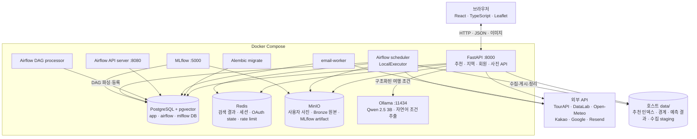

# pickkorea · 사진으로 찾는 국내 여행지

저장소 이름은 abroad-to-korea, 서비스 이름은 pickkorea (2026-10-11 닮은꼴에서 바꿈).

> 최종 갱신: **2026-10-10 (Asia/Seoul)**

해외 여행 사진을 올리면 분위기가 닮은 국내 시군구와 관광지를 추천하고, 혼잡도·날씨·예상 경비·동네별 할 거리와 공식 여행코스까지 이어서 보여 주는 웹서비스다.

교육 과정 팀 프로젝트이며, 이 문서는 **2026-10-10 현재 코드와 로컬 Docker 환경**을 기준으로 작성했다. 상세 진행 기록과 평가 근거는 [`docs/HANDOFF.md`](docs/HANDOFF.md), 운영 방법은 [`docs/INFRASTRUCTURE.md`](docs/INFRASTRUCTURE.md)에 있다.

## 현재 상태 (2026-10-10 기준)

- React 화면과 FastAPI API, 이메일·Google·Kakao 로그인, PostgreSQL·Redis·MinIO가 연결되어 있다.
- Airflow 3의 API server, DAG processor, scheduler가 분리되어 4개 DAG를 등록·실행한다.
- MLflow는 PostgreSQL backend와 MinIO artifact 저장소를 사용한다.
- 회원·인증·저장 지역·피드백·사진 메타데이터는 PostgreSQL에 저장한다.
- 관광지·레포츠·음식점·축제·공식 코스 API는 PostgreSQL의 게시 데이터를 조회한다.
- 추천 임베딩·행정동 경계·혼잡도·날씨 같은 모델·지도 자산은 `data/`에서 읽는다.

## 주요 기능

| 영역 | 구현 내용 |
|---|---|
| 탐색 | 230개 시군구 사진 피드, 이름·초성 검색, 조건 칩, 월별 순위와 축제 목록 |
| 사진 추천 | JPG·PNG·WEBP·HEIC, 관심 영역 자르기, CLIP 장면 태그, 닮은 시군구 최대 30곳 |
| 자연어 추천 | Ollama가 여행 문장을 조건으로 변환, CLIP·PostgreSQL이 실제 관광지 후보 선정 |
| 재정렬 | 사진 유사도 우선, 출발지 거리, 혼잡도·계절 조건과 로그인 사용자 취향으로 후보 30곳 안에서 재정렬 |
| 지역 상세 | 월별 방문자·혼잡도, 16일 비 예보와 과거 기록, 읍·면·동 지도, 관광지·레포츠·음식점·축제 |
| 여행 계획 | 1인 당일·1박 예상 경비, 한국관광공사 공식 코스, 자동차·단거리 도보 이동 시간 |
| 회원 | 이메일 가입·로그인, Google·Kakao OAuth, 비밀번호 재설정, 저장 지역, 회원 탈퇴 |
| 사진·피드백 | 보관에 동의한 로그인 사용자 사진만 MinIO에 저장, 좋아요·싫어요는 PostgreSQL에 저장 |

이메일 가입은 인증 메일 없이 즉시 활성화된다. 같은 이메일의 **검증된 OAuth 계정끼리만** 자동 통합하며, 이메일 가입 계정은 로그인 후 Google·Kakao를 직접 연결해야 계정 선점 위험을 막을 수 있다.

## 아키텍처



2026-10-10 현재 PostgreSQL은 회원 데이터와 관광 콘텐츠의 serving source다. Airflow는 `data/raw/`에 받은 원본을 검증해 PostgreSQL에 멱등 게시하고 MinIO에 체크섬 단위로 보관한다. CLIP 임베딩·행정동 경계·예측 결과처럼 재생성 가능한 모델·지도 자산만 파일로 유지한다.

## 기술 스택

| 구분 | 기술 |
|---|---|
| Frontend | React 19, TypeScript 6, Vite 8, Leaflet |
| API | FastAPI, Pydantic, SQLAlchemy async, Uvicorn |
| ML·분석 | Ollama, Qwen 2.5 3B, PyTorch CPU, Transformers CLIP ViT-B/32, scikit-learn, LightGBM |
| Data | pandas, NumPy, TourAPI, DataLabService, Open-Meteo |
| Storage | PostgreSQL 16 + pgvector, Redis 7.4, MinIO |
| Workflow·MLOps | Airflow 3.1.1 LocalExecutor, Alembic, MLflow 3.15 |
| Auth·Mail | Argon2, Google OAuth, Kakao OAuth, Resend |
| Runtime | Docker Compose, Python 3.12, Node 24 |

개발·API Python 패키지는 루트 [`requirements.txt`](requirements.txt) 하나에서 관리한다. Airflow·MLflow 컨테이너에만 필요한 런타임 패키지는 각 Dockerfile에 버전을 고정해 API 이미지가 불필요하게 커지는 것을 막는다.

## 추천·예측

### 로컬 LLM 자연어 추천

Ollama는 장소를 직접 생성하지 않고 사용자의 문장을 월·지역·분위기·거리 조건과 영문 CLIP 풍경 설명으로 바꾼다. 실제 후보와 사진은 PostgreSQL에 게시된 TourAPI 데이터에서만 반환한다. Ollama가 꺼져 있거나 응답 형식이 잘못되면 제한적인 키워드 해석으로 대체한다.

```bash
docker compose up -d ollama
docker compose exec ollama ollama pull qwen2.5:3b
docker compose up --build -d api

curl -X POST http://localhost:8000/api/travel/recommend \
  -H 'Content-Type: application/json' \
  -d '{"query":"부산에서 가까운 조용한 바다 마을", "limit":5}'
```

API 컨테이너는 `http://ollama:11434`, 호스트에서 직접 실행한 API는 기본값 `http://localhost:11434`를 사용한다. 모델 파일은 `ollama-data` Docker 볼륨에 보관된다.

### 사진 유사도

1. 업로드 사진을 CLIP 512차원 벡터로 변환한다.
2. 국내 관광지별 가장 닮은 사진 1장을 남긴다.
3. 상위 100개 관광지 유사도를 시군구별로 합산해 후보 30곳을 만든다.
4. 사진 유사도 비중을 최소 50% 유지하면서 거리·혼잡도·계절 조건으로 후보 안에서 재정렬한다.
5. 로그인 사용자의 좋아요·싫어요·저장 지역이 3개 이상이면 취향 가중치 20%로 같은 후보 안에서만 순서를 조금 조정한다.

개발셋 해외지 23곳에서 Hit@5 57%, Hit@10 74%였고, 새 해외지 15곳 파일럿의 Hit@10은 40%였다. 사람 평가 150건은 그럴듯함 69%, 엉뚱함 16%였다. 표본이 작고 개발셋 선택 영향이 있으므로 절대 정확도로 해석하지 않는다.

### 혼잡도와 경비

- 2026-10-10 기준 서비스 혼잡도는 시군구 월별 외지인 방문자 ridge 예측을 사용한다. 2025년 검증 WAPE는 5.6%, 전년 같은 달 기준선은 7.7%다.
- 연휴 보정 모델은 별도 실험이며 2026-10-10 현재 서비스 응답에는 월 단위 모델을 사용한다.
- 예상 경비는 ML 예측이 아니라 국민여행조사 2023~2025 원자료의 1인 가중 중앙값과 25~75분위다.
- MLflow 실험은 `clip-model-comparison`, `congestion-baseline`, `congestion-holiday-experiments`로 분리한다.

## 데이터베이스

PostgreSQL 인스턴스 하나 안에서 애플리케이션·Airflow·MLflow DB와 계정을 분리한다.

| 테이블 그룹 | 주요 테이블 |
|---|---|
| 회원·인증 | `users`, `auth_identities`, `auth_sessions`, `one_time_tokens`, `user_preferences` |
| 사용자 기능 | `saved_regions`, `feedback`, `media_assets`, `email_outbox` |
| 수집 이력 | `data_sources`, `ingestion_runs`, `raw_objects` |
| 관광 데이터 | `regions`, `places`, `place_images`, `festivals` |
| 분석 데이터 | `visitor_metrics`, `climate_daily`, `image_embeddings` |

2026-10-10 기준 migration head는 `20261010_03`이다. 이메일은 대소문자를 무시하고 유일하며, 사용자당 OAuth 공급자 하나, 익명·로그인 피드백 중복 방지, 주요 FK 삭제 정책과 pgvector HNSW 인덱스가 적용돼 있다.

같은 날 로컬 백필 기준 활성 데이터는 지역 230개, 장소·코스·축제 콘텐츠 31,707개, 이미지 메타데이터 109,399개, 축제 일정 883개다. 공식 코스 1,068개는 정류장 원문까지 게시됐다.

## Airflow 일정 (2026-10-10 기준)

기본 timezone이 UTC이므로 아래 한국 시각은 UTC+9로 환산한 값이다.

| DAG | 주기 | 한국 시각 | 작업 |
|---|---|---|---|
| `tour_data_daily` | 매일 `00:15 UTC` | 09:15 | 추가 사진·대표메뉴·향후 365일 축제 수집, 게시, 사진 캐시 |
| `tour_catalog_daily` | 매일 `01:45 UTC` | 10:45 | 관광지·레포츠·음식점 카탈로그 수집과 게시 |
| `user_media_cleanup_hourly` | 매시간 | 매시간 | 만료된 사용자 업로드 삭제 |
| `regional_metrics_monthly` | 매월 2일 `03:00 UTC` | 12:00 | 방문자 수와 행정동 인구 수집 |

TourAPI 작업은 pool slot 1개로 직렬화하며 일일 작업은 최대 3회 재시도한다. Airflow 3에서 필수인 DAG processor도 별도 컨테이너로 실행한다.

## 실행

### 준비 사항

- Docker Desktop과 WSL 2 연동
- 저장소 루트의 `.env`
- 팀 공유 저장소에서 받은 `data/` 파일
- OAuth·Resend·외부 API 기능을 쓸 경우 각 서비스 키

`.env`와 데이터 본체는 Git에 올리지 않는다. 새 개발 환경에서는 팀 내부의 안전한 채널로 `.env`를 전달받거나 직접 만들어야 한다. 설정 키는 다음 그룹으로 나뉜다.

| 목적 | 키 |
|---|---|
| DB·캐시 | `POSTGRES_PASSWORD`, `APP_DB_PASSWORD`, `AIRFLOW_DB_PASSWORD`, `MLFLOW_DB_PASSWORD`, `DATABASE_URL`, `REDIS_URL` |
| 객체·실험 | `MINIO_ROOT_USER`, `MINIO_ROOT_PASSWORD`, `MINIO_ENDPOINT`, `MINIO_ACCESS_KEY`, `MINIO_SECRET_KEY`, `MINIO_BUCKET`, `MLFLOW_TRACKING_URI` |
| 인증·메일 | `PUBLIC_BASE_URL`, `COOKIE_SECURE`, `GOOGLE_CLIENT_ID`, `GOOGLE_CLIENT_SECRET`, `KAKAO_CLIENT_ID`, `KAKAO_CLIENT_SECRET`, `RESEND_API_KEY`, `RESEND_FROM_EMAIL` |
| 데이터 API | `TOUR_API_KEY`, 추가 TourAPI 키, `NAVER_CLIENT_ID`, `NAVER_CLIENT_SECRET`, `KAKAO_REST_API_KEY` |

### 전체 스택

```bash
docker compose config --quiet
docker compose up --build -d
docker compose ps -a
curl http://localhost:8000/api/health
```

기존 `data/raw/tourapi/`를 처음 게시하는 환경에서는 API를 시작하기 전에 한 번 백필한다.

```bash
docker compose exec airflow-api-server bash -lc \
  'cd /workspace && python src/ingest/publish_tour.py --logical-date "$(date +%F)" --dag-id manual_backfill'
docker compose restart api
```

최초 빌드는 Python·ML 의존성과 MinIO 소스 빌드 때문에 오래 걸릴 수 있다. 정상 상태는 API·Airflow 3개 프로세스·email-worker·MinIO가 `Up`, PostgreSQL·Redis·MLflow가 `healthy`, `migrate`·`airflow-init`·`mlflow-db-init`가 `Exited (0)`이다.

| 접속 대상 | 주소 | 비고 |
|---|---|---|
| Web/API | `http://localhost:8000` | API 문서 `/docs` |
| Airflow | `http://localhost:8080` | DAG 확인·운영 |
| MLflow | `http://localhost:5000` | experiment·run·artifact |
| PostgreSQL | `127.0.0.1:5434` | DBeaver DB `abroad_to_korea`, 사용자 `app` |
| Redis | `localhost:6379` | 개발 환경에서만 호스트 공개 |
| MinIO | `http://localhost:9000`, `http://localhost:9001` | S3 API, Console |

DBeaver 비밀번호는 `.env`의 `APP_DB_PASSWORD`다. 컨테이너끼리는 PostgreSQL `postgres:5432`, Redis `redis:6379`, MinIO `minio:9000`으로 연결한다.

### 로컬 개발

```bash
python3.12 -m venv .venv
source .venv/bin/activate
pip install -r requirements.txt

cd web
npm ci
npm run build
cd ..

uvicorn app.main:app --port 8000
```

API 시작 시 CPU에서 CLIP 모델과 사진 인덱스를 읽어 수십 초가 걸릴 수 있다. 화면 개발은 API를 실행한 상태에서 `cd web && npm run dev`로 진행한다.

## 운영 명령

```bash
# 스키마 상태와 ORM 드리프트
docker compose run --rm migrate alembic -c infra/alembic.ini current
docker compose run --rm migrate alembic -c infra/alembic.ini check

# Airflow 상태와 DAG 등록
docker compose exec airflow-api-server airflow jobs check --job-type DagProcessorJob --allow-multiple --limit 100
docker compose exec airflow-api-server airflow jobs check --job-type SchedulerJob --allow-multiple --limit 100
docker compose exec airflow-api-server airflow dags list

# 주요 로그
docker compose logs --tail=200 api
docker compose logs --tail=200 airflow-dag-processor
docker compose logs --tail=200 airflow-scheduler
```

`docker compose down -v`는 PostgreSQL·Redis·MinIO 볼륨을 삭제하므로 데이터가 필요하면 실행하지 않는다.

## 테스트

```bash
.venv/bin/python -m pytest -q
cd web && npm run build && npm run lint
```

Python 테스트는 API 계약, 추천 결과 회귀, DB 제약, 마이그레이션 기반 함수, 메일 템플릿, MLflow 기록을 확인한다. 추천 테스트에는 Git에서 제외된 로컬 `data/`가 필요하다.

## 폴더 구조

```text
app/                 FastAPI, 추천·지역·회원·사진 API
web/                 React 화면
src/collect/         공공데이터 수집
src/model/           CLIP 실험·평가
src/forecast/        혼잡도 모델
src/cost/            예상 경비 표 생성
src/ingest/          MinIO 보관·PostgreSQL 게시·사진 캐시
src/mlops/           MLflow 공통 기록
src/ops/             만료 사진 정리
infra/airflow/dags/  Airflow DAG
infra/migrations/    Alembic migration
infra/postgres/      DB·계정 초기화
infra/docker/        Airflow·MLflow·MinIO 이미지
tests/               pytest
docs/                설계·진행·운영 문서
data/                로컬 데이터, 본체는 Git 제외
```

각 주요 폴더에 세부 README가 있다.

## 데이터 출처

| 데이터 | 출처 | 용도 |
|---|---|---|
| 관광지·레포츠·음식점·축제·코스 | 한국관광공사 TourAPI KorService2 | 추천 후보와 지역 상세 |
| 지역별 방문자 수 | 한국관광공사 DataLabService | 혼잡도 실측·예측 |
| 공휴일 | 한국천문연구원 특일정보 | 연휴 예측 실험 |
| 주민등록 인구 | 행정안전부 | 도시·시골 구분 |
| 행정동 경계 | vuski/admdongkor, 원자료 통계청 SGIS | 동네 지도 |
| 해안선 | Natural Earth | 바다 거리 조건 |
| 과거 날씨·예보 | Open-Meteo | 계절 조건과 비 정보 |
| 해외 데모 사진 | Wikimedia Commons | 검색 예시·평가 |
| 여행 경비 | 국민여행조사 2023~2025 | 당일·1박 예상 경비 |

관광 사진은 공공누리 1·3유형만 서비스에 사용한다. 파일별 출처·라이선스와 재생성 방법은 [`data/README.md`](data/README.md)에 기록한다.

## 남은 작업 (2026-10-10 기준)

- 실제 사용자 질문을 이용한 자연어 추천 품질 평가
- 예약·결제 연동
- 운영 환경의 HTTPS, 비밀 관리, 백업·복구, Airflow 실패 알림과 수집 지연 모니터링
- 더 큰 홀드아웃과 여러 평가자를 이용한 추천 품질 검증
