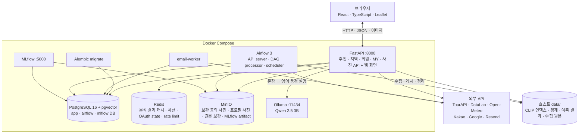

# pickkorea · 사진으로 찾는 국내 여행지

> 최종 갱신: **2026-10-11 (Asia/Seoul)** · 저장소 이름 `abroad-to-korea`, 서비스 이름 `pickkorea` (2026-10-11 '닮은꼴'에서 바꿈)

가 보고 싶은 해외 여행지 사진을 올리면 분위기가 닮은 국내 시군구와 관광지를 찾아 주는 웹서비스다. 찾은 곳의 혼잡도·날씨·예상 경비·동네별 먹거리와 할 거리·공식 여행코스까지 이어서 보여 준다. 사진 없이 문장으로 묻는 AI 여행 추천도 있다.

교육 과정 팀 프로젝트(2026-10-01 ~ 10-16)이며, 이 문서는 **2026-10-11 현재 코드와 로컬 Docker 환경**을 기준으로 썼다. 날짜별 진행 기록과 평가 근거는 [`docs/HANDOFF.md`](docs/HANDOFF.md), 운영 방법은 [`docs/INFRASTRUCTURE.md`](docs/INFRASTRUCTURE.md)에 있다.

## 화면 구성

아래 탭 5개. 가운데가 대표 기능인 사진으로 찾기다.

| 탭 | 하는 일 |
|---|---|
| 홈 | 230개 시군구 사진 피드, 분류(바다·산숲·시골·도시) 이야기, 이번 주 축제, 로그인 사용자의 "저장한 곳과 닮은 곳" 줄 |
| 탐색 | 해외 풍경 사진 213장. 누르면 바로 닮은 국내 여행지를 찾는다 |
| 사진으로 찾기 | 내 사진 올리기(JPG·PNG·WEBP·HEIC) → 관심 영역 자르기 → 닮은 시군구 최대 30곳. 게시물마다 닮았어요·별로예요·저장 |
| AI 여행 | "수원에서 가까운 조용한 바다"처럼 문장으로 묻기. 결과는 세로 카드(혼잡도·장면 칩, 저장) |
| MY | 프로필, 내 취향 반영 상태, 저장한 곳(가로 카드·전체 보기), 저장한 곳의 한 달 안 축제, 내가 누른 반응 목록(취소 가능) |

시군구를 누르면 지역 상세: 12개월 방문자·혼잡도, 16일 비 예보와 과거 기록, 읍·면·동 지도와 동네별 먹거리, 관광지·레포츠·축제, 공식 여행코스와 구간별 이동 시간(자동차·단거리 도보), 1인 당일·1박 예상 경비. 사진 출처·라이선스는 상세 맨 아래에 모아 둔다.

계정 설정(MY → 계정 설정): 프로필 사진, 닉네임 변경, 내 취향 반영 켜기·끄기, 기본 출발지(5개 도시 또는 시군구 검색), 로그인 수단 보기·해제, 비밀번호 변경(이메일 가입자), 로그아웃, 회원 탈퇴.

## 추천은 이렇게 동작한다

### 1단계: 사진 닮음으로 후보 30곳

1. 사진을 CLIP ViT-B/32 512차원 벡터로 바꾼다 (모델은 학습하지 않고 그대로 쓴다).
2. 국내 관광지마다 가장 닮은 사진 1장을 남긴다.
3. 상위 100개 관광지 유사도를 시군구별로 합산해 후보 30곳을 만든다.

### 2단계: 후보 30곳 안에서만 순서 조정

후보를 새로 넣거나 빼지 않고 순서만 바꾼다. 어느 단계든 사진 닮음이 주 신호다.

| 순서 | 조정 | 언제 | 세기 |
|---|---|---|---|
| ① 조건 | 출발지 거리·혼잡도·여행 월 날씨 | 사용자가 조건을 고르면 | 사진 비중 50% 이상 유지 |
| ② 같은 사진을 본 사람들의 반응 | 같은 사진에 쌓인 닮았어요·별로예요 | 로그인 사용자 표가 있으면 (한 사람은 관광지마다 1표) | 0.25 × (닮았어요−별로예요)/(전체+2), 한 후보 최대 약 7계단 |
| ③ 내 취향 | 내가 누른 닮았어요·별로예요·저장한 곳의 사진 평균 방향 | 로그인 + 신호 3개 이상 + 계정 설정에서 켜 둠 | 20%, 한 후보 최대 약 7계단 |

②·③은 **강화학습이나 모델 재학습이 아니다.** 쌓인 반응으로 순서만 계산해 바꾼다. 반응은 `feedback` 테이블에 사진 키(`photo_key`)·보인 순위와 함께 쌓이며, 나중에 학습 데이터로 쓸 수 있다.

### AI 여행 (자연어)

Ollama의 Qwen 2.5 3B는 문장을 영어 풍경 설명으로 옮기는 일만 한다. 출발지·달·지역·조건(바다·산숲·한적·도시·시골·날씨)·정렬은 **원문에서 확인되는 것만 규칙으로 뽑아 LLM 값을 덮어쓴다.** 실제 장소와 사진은 PostgreSQL에 게시된 TourAPI 데이터에서만 고른다. Ollama가 꺼져 있으면 규칙만으로 동작한다.

- 알아듣는 출발지: 5개 도시와 시군구 이름("수원에서", "청주에서 멀지 않은", "서울 근교")
- 광주·전남은 데이터 이름 '전남광주통합특별시'로 바꾼다
- '산책·섬세' 같은 단어 일부 오인식, '바다 말고' 같은 부정, 계절(봄 4·여름 7·가을 10·겨울 1)을 처리한다

```bash
curl -X POST http://localhost:8000/api/travel/recommend \
  -H 'Content-Type: application/json' \
  -d '{"query":"수원에서 가까운 조용한 바다", "limit":5}'
```

## 평가 결과

실제로 실행한 결과만 적는다. 표본이 작아 절대 정확도로 해석하지 않는다.

| 무엇을 | 결과 | 주의 |
|---|---|---|
| 사진 추천 (개발셋 해외지 23곳) | Hit@5 57%, Hit@10 74% | 개발셋으로 방법을 골랐다 |
| 사진 추천 (새 해외지 15곳 홀드아웃) | Hit@10 40% | 정답이 1~2곳뿐이라 낮게 잰다 |
| 사람 평가 (상위 5곳 150건) | 그럴듯함 69%, 엉뚱함 16% | 평가자 1명 |
| AI 여행 질문 해석 (60문장, 2026-10-11) | 고치기 전 dev 52%·holdout 35% → 고친 뒤 둘 다 100% | holdout도 같은 사람이 써서 독립 평가가 아니다. LLM 출력만은 dev 5% |
| 혼잡도 예측 (시군구 월별 외지인 방문자, 2025 검증) | WAPE 5.6% (전년 같은 달 기준선 7.7%) | |
| 만족도 지표 (`GET /api/feedback/stats`) | 순위 구간별 닮았어요 비율 | 2026-10-11 현재 반응 4개라 아직 의미 없음. 구간당 30표 이상 필요 |

예상 경비는 예측 모델이 아니라 국민여행조사 2023~2025 원자료의 1인 가중 중앙값과 25~75분위다. 연휴 보정 혼잡도 모델은 실험만 했고 서비스에는 월 단위 모델을 쓴다. MLflow 실험은 `clip-model-comparison`, `congestion-baseline`, `congestion-holiday-experiments`로 나뉜다.

## 아키텍처



PostgreSQL이 회원 데이터와 관광 콘텐츠의 서비스 원본이다. Airflow가 `data/raw/`에 받은 원본을 검증해 PostgreSQL에 멱등 게시하고 MinIO에 체크섬 단위로 보관한다. CLIP 임베딩·행정동 경계·예측 결과처럼 다시 만들 수 있는 모델·지도 자산만 파일로 둔다.

## 기술 스택

| 구분 | 기술 |
|---|---|
| Frontend | React 19, TypeScript 6, Vite 8, Leaflet, oxlint |
| API | FastAPI 0.118, Pydantic, SQLAlchemy 2 async, Uvicorn |
| ML·분석 | CLIP ViT-B/32 (Transformers 5, PyTorch 2 CPU), Ollama 0.12 + Qwen 2.5 3B, scikit-learn, LightGBM |
| Data | pandas, NumPy, TourAPI KorService2, DataLabService, Open-Meteo |
| Storage | PostgreSQL 16 + pgvector, Redis 7.4, MinIO |
| Workflow·MLOps | Airflow 3.1 LocalExecutor, Alembic, MLflow 3.15 |
| Auth·Mail | Argon2, Google OAuth, Kakao OAuth, Resend |
| Runtime | Docker Compose, Python 3.12, Node 24 |

Python 패키지는 루트 [`requirements.txt`](requirements.txt) 하나에 버전을 고정해 둔다. Airflow·MLflow 컨테이너에만 필요한 패키지는 각 Dockerfile에 고정한다.

## 데이터베이스

PostgreSQL 인스턴스 하나에 애플리케이션·Airflow·MLflow DB와 계정을 나눠 둔다. migration head는 **`20261011_04`**(반응에 사진 키·순위 추가)다.

| 테이블 그룹 | 주요 테이블 |
|---|---|
| 회원·인증 | `users`, `auth_identities`, `auth_sessions`, `one_time_tokens`, `user_preferences`(취향 반영·기본 출발지·프로필 사진) |
| 사용자 기능 | `saved_regions`, `feedback`(닮았어요·별로예요, 사진 키·보인 순위), `media_assets`(보관 사진·프로필 사진), `email_outbox` |
| 수집 이력 | `data_sources`, `ingestion_runs`, `raw_objects` |
| 관광 데이터 | `regions`, `places`, `place_images`, `festivals` |
| 분석 데이터 | `visitor_metrics`, `climate_daily`, `image_embeddings` |

2026-10-11 로컬 DB 기준 활성 데이터: 시군구 230곳, 장소 31,707곳(음식점 13,402 · 관광지 12,603 · 레포츠 3,751 · 공식 코스 1,068 · 축제 883), 이미지 메타데이터 109,399건.

계정 규칙: 이메일은 대소문자를 무시하고 유일하다. 같은 이메일의 **검증된 OAuth 계정끼리만** 자동 통합한다. 회원 탈퇴 시 이메일·닉네임을 지우고 로그인 수단·저장한 곳·설정을 삭제해 같은 이메일로 다시 가입할 수 있다. 반응 기록은 모델 평가용으로 남는다.

## Airflow 일정

timezone이 UTC라 한국 시각은 +9시간이다.

| DAG | 주기 | 한국 시각 | 작업 |
|---|---|---|---|
| `tour_data_daily` | 매일 `00:15 UTC` | 09:15 | 추가 사진·대표메뉴·향후 365일 축제 수집, 게시, 사진 캐시 |
| `tour_catalog_daily` | 매일 `01:45 UTC` | 10:45 | 관광지·레포츠·음식점 목록 수집과 게시 |
| `user_media_cleanup_hourly` | 매시간 | 매시간 | 기한이 지난 사용자 사진(바꾼 프로필 사진 포함) 삭제 |
| `regional_metrics_monthly` | 매월 2일 `03:00 UTC` | 12:00 | 방문자 수와 행정동 인구 수집 |

TourAPI 작업은 pool slot 1개로 한 번에 하나씩 돌리고, 일일 작업은 최대 3회 재시도한다.

## 실행

### 준비

- Docker Desktop (WSL 2 연동)
- 저장소 루트의 `.env` (항목은 아래 표, 값은 팀 내부 채널로 전달)
- 팀 공유 드라이브의 `data/` 파일

`.env`와 데이터 본체는 Git에 올리지 않는다.

| 목적 | 키 |
|---|---|
| DB·캐시 | `POSTGRES_PASSWORD`, `APP_DB_PASSWORD`, `AIRFLOW_DB_PASSWORD`, `MLFLOW_DB_PASSWORD`, `DATABASE_URL`, `REDIS_URL` |
| 객체·실험 | `MINIO_ROOT_USER`, `MINIO_ROOT_PASSWORD`, `MINIO_ENDPOINT`, `MINIO_ACCESS_KEY`, `MINIO_SECRET_KEY`, `MINIO_BUCKET`, `MLFLOW_TRACKING_URI` |
| 인증·메일 | `PUBLIC_BASE_URL`, `COOKIE_SECURE`, `GOOGLE_CLIENT_ID`, `GOOGLE_CLIENT_SECRET`, `KAKAO_CLIENT_ID`, `KAKAO_CLIENT_SECRET`, `RESEND_API_KEY`, `RESEND_FROM_EMAIL` |
| 데이터 API | `TOUR_API_KEY`(추가 키 `_2`~`_5`), `NAVER_CLIENT_ID`, `NAVER_CLIENT_SECRET`, `KAKAO_REST_API_KEY` |

### 전체 스택

```bash
docker compose up --build -d          # migrate 가 먼저 돌아 DB 스키마를 맞춘다
docker compose exec ollama ollama pull qwen2.5:3b   # 처음 한 번 (AI 여행)
docker compose ps -a
curl http://localhost:8000/api/health
```

`data/raw/tourapi/`를 처음 게시하는 환경에서는 API를 시작하기 전에 한 번 백필한다.

```bash
docker compose exec airflow-api-server bash -lc \
  'cd /workspace && python src/ingest/publish_tour.py --logical-date "$(date +%F)" --dag-id manual_backfill'
docker compose restart api
```

**코드나 화면을 고친 뒤**에는 API 이미지를 다시 빌드해야 8000번에 반영된다.

```bash
docker compose up -d --build --no-deps api
```

| 접속 대상 | 주소 | 비고 |
|---|---|---|
| Web/API | `http://localhost:8000` | API 문서 `/docs` |
| Airflow | `http://localhost:8080` | DAG 확인·운영 |
| MLflow | `http://localhost:5000` | experiment·run·artifact |
| PostgreSQL | `127.0.0.1:5434` | DB `abroad_to_korea`, 사용자 `app`, 비밀번호 `.env`의 `APP_DB_PASSWORD` |
| Redis | `localhost:6379` | 개발 환경에서만 공개 |
| MinIO | `http://localhost:9000`, `http://localhost:9001` | S3 API, Console |
| Ollama | `http://localhost:11434` | AI 여행 |

정상 상태: API·Airflow 3개·email-worker·MinIO가 `Up`, PostgreSQL·Redis·MLflow·Ollama가 `healthy`, `migrate`·`airflow-init`·`mlflow-db-init`가 `Exited (0)`.

### 로컬 개발

```bash
python3.12 -m venv .venv && source .venv/bin/activate
pip install -r requirements.txt
cd web && npm ci && npm run build && cd ..
uvicorn app.main:app --port 8000      # CLIP 모델을 읽느라 시작에 수십 초
```

화면 개발은 API를 띄운 상태에서 `cd web && npm run dev`.

## 테스트와 평가 도구

```bash
.venv/bin/python -m pytest tests -q      # 59개 (2026-10-11 전부 통과), 약 70초
cd web && npm run build && npm run lint  # 타입 검사·빌드, oxlint (경고만 있고 오류 없음)
```

pytest는 API 계약, 추천 결과 회귀, 개인 맞춤·사진별 반응 재정렬의 이동 한도, AI 여행 해석 60문장, 계정 입력 검사, DB 제약, 메일 템플릿, MLflow 기록을 확인한다. 추천 테스트에는 Git에서 빠진 로컬 `data/`와 실행 중인 PostgreSQL이 필요하다.

| 도구 | 하는 일 |
|---|---|
| `tools/eval_intent.py` | AI 여행 질문 해석 평가 (`tests/data/intent_cases.json`). `--llm`은 Ollama까지 거치는 서비스 경로, `--llm --raw`는 규칙 보정 없는 LLM 출력 |
| `GET /api/feedback/stats` | 순위 구간·사진 종류별 닮았어요 비율 |

## 운영 명령

```bash
# 스키마 상태와 ORM 드리프트
docker compose run --rm migrate alembic -c infra/alembic.ini current
docker compose run --rm migrate alembic -c infra/alembic.ini check

# Airflow
docker compose exec airflow-api-server airflow dags list
docker compose exec airflow-api-server airflow jobs check --job-type SchedulerJob --allow-multiple --limit 100

# 로그
docker compose logs --tail=200 api
docker compose logs --tail=200 airflow-scheduler
```

`docker compose down -v`는 PostgreSQL·Redis·MinIO 볼륨을 지우므로 데이터가 필요하면 쓰지 않는다.

## 폴더 구조

```text
app/                 FastAPI: 추천(recommender)·AI 여행(llm)·MY·개인 맞춤(personal)·회원(auth)·지역·사진 API
web/                 React 화면
src/collect/         공공데이터 수집
src/model/           CLIP 실험·평가
src/forecast/        혼잡도 모델
src/cost/            예상 경비 표 생성
src/ingest/          MinIO 보관·PostgreSQL 게시·사진 캐시
src/mlops/           MLflow 공통 기록
src/ops/             기한 지난 사진 정리
infra/airflow/dags/  Airflow DAG
infra/migrations/    Alembic migration
infra/postgres/      DB·계정 초기화
infra/docker/        Airflow·MLflow·MinIO 이미지
tests/               pytest, 평가 문장(tests/data/)
tools/               평가·발표 자료 스크립트
docs/                설계·진행·운영 문서
data/                로컬 데이터 (본체는 Git 제외)
```

주요 폴더마다 세부 README가 있다.

## 데이터 출처

| 데이터 | 출처 | 용도 |
|---|---|---|
| 관광지·레포츠·음식점·축제·코스 | 한국관광공사 TourAPI KorService2 | 추천 후보와 지역 상세 |
| 지역별 방문자 수 | 한국관광공사 DataLabService | 혼잡도 실측·예측 |
| 공휴일 | 한국천문연구원 특일정보 | 연휴 예측 실험 |
| 주민등록 인구 | 행정안전부 | 도시·시골 구분 |
| 행정동 경계 | vuski/admdongkor (원자료 통계청 SGIS) | 동네 지도 |
| 해안선 | Natural Earth | 바다 거리 조건 |
| 과거 날씨·예보 | Open-Meteo | 계절 조건과 비 정보 |
| 이동 시간·장소 검색 | 카카오모빌리티 길찾기, 카카오 로컬 | 코스 구간 시간 (결과는 서버 메모리에만) |
| 음식점 보조 사진 | 네이버 이미지 검색 | 대표 사진 없는 음식점 썸네일 (파일 저장 안 함) |
| 해외 데모 사진 | Wikimedia Commons | 탐색 탭·평가 |
| 여행 경비 | 국민여행조사 2023~2025 | 당일·1박 예상 경비 |

관광 사진은 공공누리 1·3유형만 쓰고, 3유형은 자르거나 위에 무엇을 겹치지 않는다(사진은 칸 안에 통째로 넣는다). 파일별 출처·라이선스와 재생성 방법은 [`data/README.md`](data/README.md)에 있다.

## 남은 작업 (2026-10-11 기준)

- 팀원이 직접 쓴 질문 20~30개로 AI 여행 해석 다시 평가 (지금 60문장은 같은 사람이 씀)
- 팀원이 탐색 사진으로 반응 100개 이상 눌러 만족도 지표 채우기 (발표용)
- 여러 평가자와 더 큰 홀드아웃으로 사진 추천 품질 검증
- 연휴 혼잡도(과거 연휴 배율)를 예상 경비 아래에 표시 — 보류
- 운영 환경의 HTTPS, 비밀 관리, 백업·복구, Airflow 실패 알림
