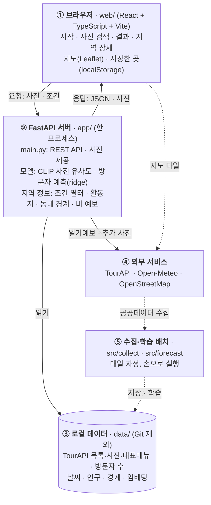

# abroad-to-korea · 닮은꼴 국내 여행지

해외 여행지 사진을 올리면 분위기가 닮은 국내 시군구와 관광지를 찾아 주고, 고른 지역의 혼잡도·비 예보·동네별 할 거리와 먹거리를 보여 주는 웹서비스다.

교육 과정 팀 프로젝트(2026-10-01 ~ 2026-10-16)의 결과물이다. 진행 기록과 평가 수치는 [`docs/HANDOFF.md`](docs/HANDOFF.md), 구성도는 [`docs/ARCHITECTURE.md`](docs/ARCHITECTURE.md)에 있다.

## 지금 되는 것 (2026-10-07 기준)

| 화면 | 기능 |
|---|---|
| 시작 | 예시 한 쌍(교토 후시미 ↔ 종로구 창경궁 홍화문)으로 서비스 설명, 사진 올리기(아이폰 HEIC 포함)·해외 예시 사진, 사진 없이 둘러보기 |
| 조건 | 바다 가까운 곳 · 산·숲이 많은 곳 · 도시 / 시골·소도시 · 시도. 칩마다 기준과 남는 시군구 수 표시 |
| 순위 목록 | 산·숲이 많은 곳, 할 거리가 많은 시골·소도시, 앞으로 축제가 많이 열리는 곳 (목록마다 거르는 조건 하나 + 정렬 기준 하나, 종합점수 없음) |
| 사진 검색 | 관심 영역 자르기 → 장면 태그 → 우선순위(사진과 최대한 비슷하게 / 출발지에서 가까운 곳) → 닮은 시군구 최대 30곳 |
| 결과 | 원본·후보 사진 나란히, 전국 지도 번호 핀, 비슷한 점·다른 점, 2~3곳 비교표, 저장(브라우저), 좋아요·별로예요, 이 사진으로 다시 찾기 |
| 지역 상세 | **혼잡도 한 줄 요약**(이번 달 예측 + 가장 한산했던 달 실측), **여행 날짜에 비가 올까**(16일 안은 일기예보, 그 밖은 과거 5년 같은 날짜 기록) |
| 동네와 먹거리 | 읍·면·동 경계 지도에 활동지가 많은 동네 Top 5. 동네를 누르면 확대되며 활동지가 점으로 나오고(누르면 사진·설명), 아래에 음식점·대표메뉴, 사진을 누르면 추가 사진 |
| 할 만한 것 | 물·바다, 산·숲, 레저, 캠핑, 체험, 먹거리, 축제를 지도와 목록으로 |

빠진 것: 로그인·개인화, 예약·결제, 여행 총비용, 이동 시간 기반 일정.

## 구성도 (지금 돌아가는 구조)



실선은 서비스 중 요청, 점선은 미리 돌려 두는 배치다. 모델은 별도 학습 없이 쓰는 CLIP(사진 유사도)과 직접 학습한 방문자 예측 모델(ridge)이다. 운영 구조(Docker·Airflow·Redis·Postgres)는 설계 중이다.

## 데이터

| 데이터 | 출처 | 용도 |
|---|---|---|
| 국문 관광정보 (KorService2) | 한국관광공사 / 공공데이터포털 | 관광지 12,603곳·레포츠·축제·음식점 13,402곳, 사진(공공누리 1·3유형만), 대표메뉴 |
| 빅데이터 지역별 방문자수 (DataLabService) | 한국관광공사 / 공공데이터포털 | 시군구별 외지인 방문자 수 2018-01 ~ 2026-08, 혼잡도 예측 학습 |
| 특일 정보 | 한국천문연구원 / 공공데이터포털 | 공휴일 (연휴 예측) |
| 행정동별 주민등록 인구 | 행정안전부 / 공공데이터포털 | 도시 / 시골·소도시 구분 |
| 행정동 경계 (admdongkor ver20260701) | vuski/admdongkor, CC BY 4.0 (원자료 통계청 SGIS) | 동네 지도 |
| 해안선 | Natural Earth (퍼블릭 도메인) | 바다 가까운 곳 |
| 날씨 | Open-Meteo, CC BY 4.0 | 과거 일별 기록(2021~2025), 16일 일기예보 |
| 해외 예시 사진 | Wikimedia Commons (사진별 라이선스) | 데모 사진 |

데이터 파일은 저장소에 넣지 않는다. 출처와 다시 받는 방법은 [`data/README.md`](data/README.md)에 있다.

매일 하루 한도(990건)로 받는 중 (2026-10-07 기준):
- 관광지 추가 사진: 12,603곳 중 5,880곳
- 음식점 대표메뉴: 13,402곳 중 1,980곳

## 폴더

```
app/           FastAPI 백엔드 (API, 추천, 조건, 지역 상세, 비 예보)
web/           React 화면
tests/         API 테스트 (pytest, 30개)
src/
  collect/     공공데이터 수집
  forecast/    방문자 예측 (p1_spec: 기준 재현, p1_holiday: 연휴 보정)
  prototype/   CLIP 유사도 실험·평가
tools/         진행 기록 PPT 생성 스크립트
docs/          HANDOFF(진행 기록) · MVP_PLAN(화면·API 계약) · ARCHITECTURE(구성도)
data/          (파일은 Git 제외)
```

## 실행

```bash
python -m venv .venv && source .venv/bin/activate
pip install pandas numpy scikit-learn python-dotenv holidays lightgbm
pip install torch --index-url https://download.pytorch.org/whl/cpu
pip install transformers pillow
pip install fastapi==0.118.0 "uvicorn==0.37.0" python-multipart==0.0.20 pillow-heif==1.8.0 shapely==2.1.2

echo "TOUR_API_KEY=<공공데이터포털 인증키>" > .env   # 포털 표시값 그대로 (재인코딩하지 않음)
```

LightGBM은 Linux/WSL에서 `sudo apt install -y libgomp1`이 먼저 필요하다.
검증한 버전: Python 3.12, pandas 2.2.3, numpy 2.1.3, scikit-learn 1.5.2, holidays 0.105, lightgbm 4.7.0, torch 2.14.1(CPU), transformers 5.18.0.

### 데이터 받기

```bash
python src/collect/tour_attractions.py                     # 관광지 목록
python src/collect/tour_attractions.py 28                  # 레포츠
python src/collect/tour_attractions.py 39                  # 음식점
python src/collect/datalab_visitors.py                     # 지역별 방문자 수
python src/forecast/p1_spec.py kasi                        # 방문자 예측 기준 재현
python src/collect/region_context.py climate 10            # 날씨 (다른 달: climate 1 2 3 ...)
python src/collect/region_context.py festivals 20251001 20261231   # 축제
python src/collect/population.py                           # 행정동 인구 (별도 활용신청)
# 동네 경계: data/raw/admdongkor/ 에 vuski/admdongkor ver20260701 HangJeongDong_ver20260701.geojson

# 매일 자정 이후 (하루 한도 990건씩 이어 받기)
python src/collect/tour_images.py 930                      # 관광지 추가 사진
python src/collect/tour_food_intro.py                      # 음식점 대표메뉴
```

### 서버 띄우기

```bash
cd web && npm install && npm run build && cd ..            # 화면 빌드 → web/dist
uvicorn app.main:app --port 8000                           # 첫 실행 때 CLIP 로딩 20~40초
# → http://localhost:8000  (API 문서: http://localhost:8000/docs)
```

화면을 고치면서 볼 때는 서버를 띄운 채로 `cd web && npm run dev` (http://localhost:5173, API는 8000으로 넘어간다).
수집한 데이터는 서버를 다시 띄워야 반영된다.

테스트: `pip install pytest httpx && python -m pytest tests -q`
기존 평가 결과·임베딩·코드가 바뀌지 않았는지(`data/interim/app/baseline_hashes.txt`)도 함께 검사한다.

## 현재 수치 (자세한 조건은 HANDOFF)

- 사진 유사도 (CLIP, 개발셋 해외지 23곳): 정답 시군구 Hit@5 57%, Hit@10 74% (무작위 약 4%·8%)
  - 처음 보는 해외지 15곳 파일럿: Hit@10 40%. 도시 장면은 강하고 특정 지점형 정답은 약하다
  - 사람 평가(평가자 1명, 30곳 × 후보 5곳): 그럴듯함 69%, 엉뚱함 16%. 조원 2~3명 평가 예정
- 방문자 예측 (검증 2025)
  - 월 단위 (서비스에 쓰는 모델): WAPE 5.6% (전년 같은 달 기준선 7.7%)
  - 일 단위: 전체 WAPE 7.3%, 연휴 관련일 13.2% (기준선 9.9% / 28.2%)

## 남은 일

- 조원 사람 평가와 새 테스트셋, 사진 수집이 끝난 뒤 재평가
- 관광지별 집중률(한국관광공사 예측 API)을 동네 지도 점에 표시 (활용신청 반영 대기)
- 서버를 다시 띄워도 분석 결과 유지(#3), 재시작 없이 새 데이터 반영(#2)
- 운영 구조(Docker·Airflow·Redis·Postgres), 발표자료
