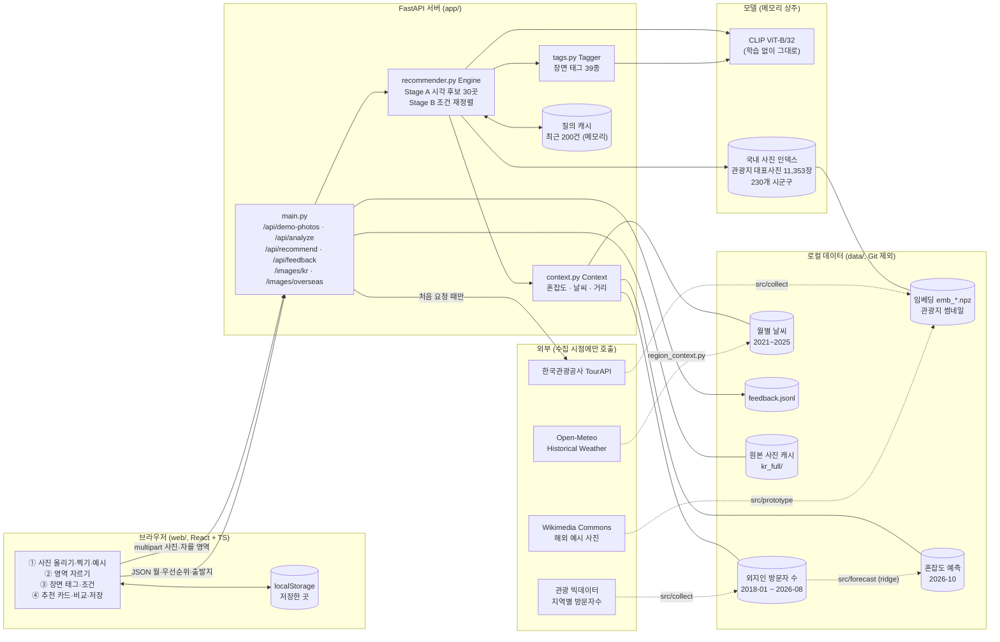
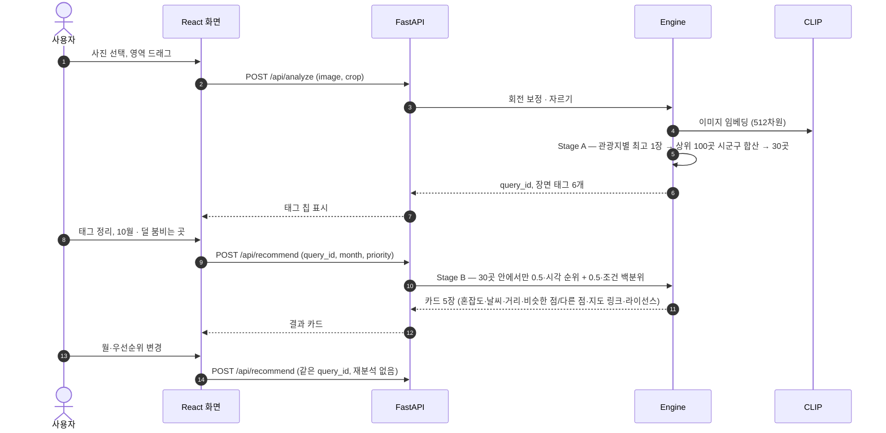

# 시스템 아키텍처 (MVP, 2026-10-04)

해외 여행지 사진 → 분위기가 닮은 국내 시군구·관광지 → 고른 달의 혼잡도·날씨·거리로 재정렬.
화면(React)과 추천 모델(FastAPI + CLIP)은 HTTP API로만 연결된다. 계약은 [MVP_PLAN.md](MVP_PLAN.md) 5장.

## 1. 전체 구성

실선은 서비스 요청 중 흐름, 점선은 미리 돌려 두는 수집·학습 배치다. 서비스 중 외부 호출은 관광지 원본 사진을 처음 보여 줄 때 TourAPI 이미지 주소에서 한 번 받아 캐시하는 것뿐이다 (실패하면 로컬 썸네일).

## 2. 추천 한 번의 흐름

## 3. 설계 원칙

| 원칙 | 구현 |
|---|---|
| 화면과 모델 분리 | 화면은 `web/src/api.ts` 타입만 안다. 모델 교체 시 `app/recommender.py`만 바꾼다 |
| 사진이 먼저 | 조건은 사진이 닮은 30곳 안에서만 순서를 바꾸고, 시각 가중치는 0.5 아래로 내리지 않는다 |
| 단일 종합점수 없음 | 카드에 시각 순위·혼잡도·날씨·거리를 따로 보여 주고, 순위가 바뀐 이유(“4위 → 2위”)를 적는다 |
| 근거 있는 값만 | 혼잡도는 실측(예측 달은 예측이라고 표시), 자료가 없으면 “자료 없음”. 예시 데이터는 `is_example`로 표시 |
| 이미지 라이선스 | 공공누리 1·3유형만 사용, 자르기·필터 없이 `object-fit: contain`, 출처 표시 |
| 기존 연구 코드 보존 | `src/prototype`·평가 결과는 읽기만. 테스트가 해시로 확인 |

## 4. 지금 구조의 한계와 다음 단계

- 단일 프로세스: 모델·인덱스·질의 캐시가 서버 메모리에 있다. 서버를 여러 대 두려면 캐시를 Redis로, 인덱스를 벡터 DB(FAISS 파일 또는 pgvector)로 옮긴다.
- 배치는 수동 실행이다. 정기 수집(관광지 사진·방문자 수·날씨)과 예측 재학습은 Airflow 같은 스케줄러로 묶는 것이 다음 단계다.
- 피드백은 파일에 쌓이기만 한다. 평가 지표(Hit@k)와 함께 보는 집계는 아직 없다.
