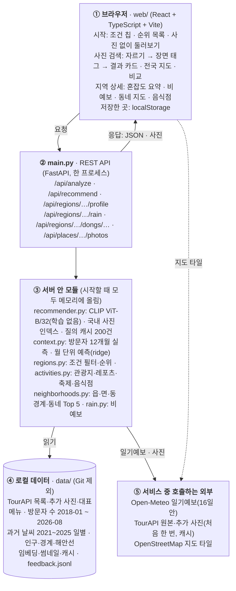
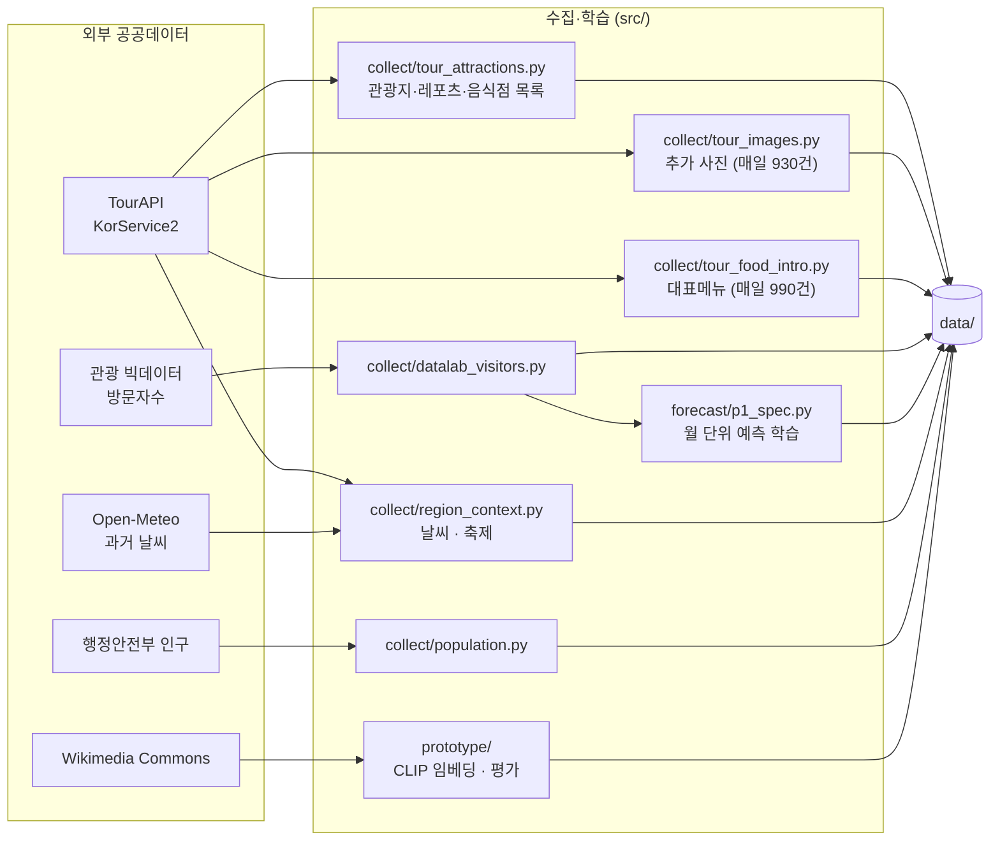
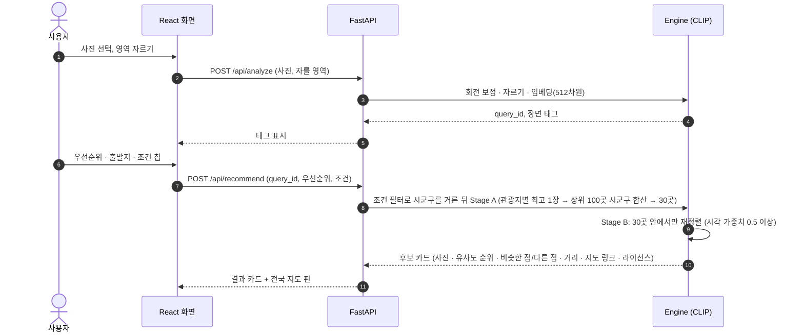
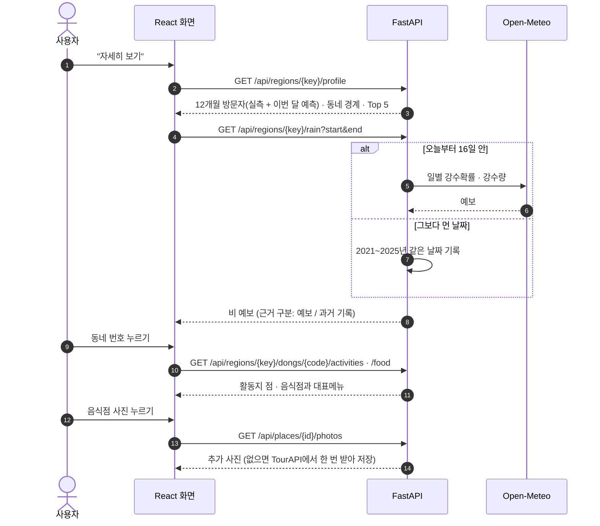

# 시스템 아키텍처 (지금 돌아가는 구조, 2026-10-07)

해외 여행지 사진 → 분위기가 닮은 국내 시군구·관광지 → 지역 상세(혼잡도·비 예보·동네·먹거리).
화면(React)과 서버(FastAPI)는 HTTP API로만 연결된다. 화면은 `web/src/api.ts`의 타입만 알고 모델 코드는 모른다.
운영 구조(Docker·Airflow·Redis·Postgres)는 아직 설계 단계라 여기 넣지 않았다.

## 1. 전체 구성

## 2. 미리 돌려 두는 배치

지금은 손으로 돌린다. 매일 자정 이후 `tour_images.py`와 `tour_food_intro.py`를 돌리고, 서버를 다시 띄워야 새 데이터가 반영된다(이슈 #2).

## 3. 요청 흐름

### 사진으로 찾기

### 지역 상세

## 4. 설계 원칙

| 원칙 | 구현 |
|---|---|
| 화면과 모델 분리 | 화면은 `web/src/api.ts` 타입만 안다. 모델 교체 시 `app/recommender.py`만 바꾼다 |
| 조건은 거르기, 사진은 순서 | 조건 필터는 후보 풀을 줄이고(기준을 화면에 표시), 그 안에서 사진 유사도로 30곳을 고른다 |
| 혼잡도는 검색이 아니라 지역 정보 | 검색 조건·우선순위에서 빼고 지역 상세에서만 보여 준다. 예측과 실측을 구분해 표시 |
| 단일 종합점수 없음 | 카드와 순위 목록에 기준 하나씩만 쓰고 그 기준을 적는다 |
| 근거 있는 값만 | 자료가 없으면 "자료 없음". 과거 날씨 기록을 예보처럼 쓰지 않는다 |
| 이미지 라이선스 | 공공누리 1·3유형만, 자르기·필터·글자 덮기 없이, 출처 표시 |
| 기존 연구 코드 보존 | `src/prototype`과 평가 결과는 읽기만. 테스트가 해시로 확인 |

## 5. 한계와 다음 단계

- 한 프로세스: 모델·인덱스·질의 캐시가 서버 메모리에 있어 재시작하면 분석 결과가 사라진다(#3). 캐시는 Redis, 인덱스는 벡터 DB(FAISS 파일 또는 pgvector)로 옮길 수 있다.
- 배치는 손으로 돌린다. Airflow 같은 스케줄러로 매일 수집 → 서버 반영을 묶는 것이 다음 단계다.
- OpenStreetMap 공식 타일은 시연용이다. 실제 서비스에서는 상용 타일이나 카카오맵으로 바꾼다.
- 피드백은 파일에 쌓이기만 한다. 평가 지표와 함께 보는 집계는 아직 없다.
